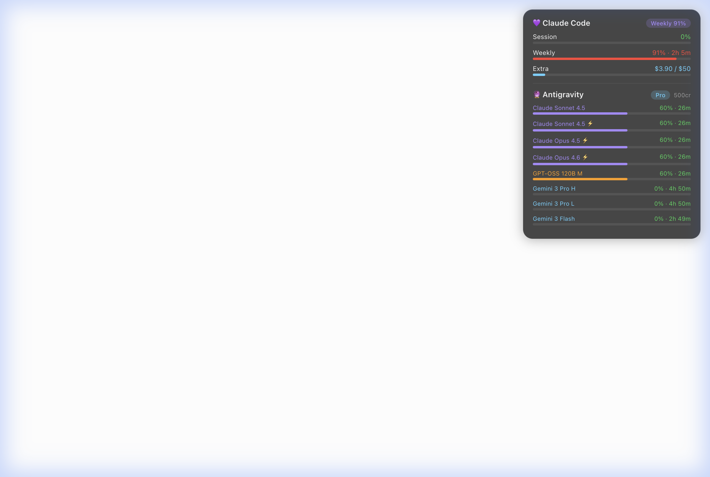

# 🎯 AI Usage Quota Widget

A beautiful macOS desktop widget that shows real-time usage quota for **Claude Code** and **Antigravity (Windsurf)** — right on your desktop.



## ✨ Features

- 💜 **Claude Code** — Session %, Weekly %, Extra usage ($), reset countdown
- 🔮 **Antigravity/Windsurf** — Per-model quota bars, plan info, credits
- 🎨 **Native macOS look** — Frosted glass dark card, color-coded progress bars
- 🔄 **Auto-refresh** — Updates every 2 minutes via LaunchAgent
- 🟢🟠🔴 **Color alerts** — Green (<70%) → Orange (70-90%) → Red (>90%)

## 📋 Prerequisites

- **macOS** (Apple Silicon or Intel)
- **Python 3** (`python3 --version`)
- **[Übersicht](https://tracesof.net/uebersicht/)** — Free desktop widget engine
  ```bash
  brew install --cask ubersicht
  ```
- At least one of:
  - **Claude Code** — Must be logged in (credentials in Keychain or `~/.claude/`)
  - **Antigravity / Windsurf** — Must be running with language server active

## 🚀 Install

```bash
git clone https://github.com/YOUR_USERNAME/ai-usage-widget.git
cd ai-usage-widget
bash install.sh
```

The installer will:

1. ✅ Check prerequisites
2. 📦 Copy files to `~/.ai-usage-widget/` and Übersicht widgets folder
3. 📊 Run initial data collection
4. ⏰ Set up LaunchAgent for auto-refresh every 2 minutes

## 🎨 Customize Position

Edit `~/Library/Application Support/Übersicht/widgets/quota.jsx`:

```javascript
// Adjust these values to reposition on your desktop
top: 555px;    // ↕ vertical position (higher = further down)
left: 20px;    // ↔ horizontal position (higher = further right)
width: 300px;  // ↔ widget width
```

Save the file — Übersicht auto-detects changes and refreshes.

## 🗑️ Uninstall

```bash
cd ai-usage-widget
bash uninstall.sh
```

## 🔧 How It Works

```
┌─────────────────┐    ┌──────────────────┐    ┌─────────────────┐
│  Claude Code API │    │ Antigravity LSP  │    │   Gemini API    │
│  (OAuth token)   │    │ (local process)  │    │  (experimental) │
└────────┬────────┘    └────────┬─────────┘    └────────┬────────┘
         │                      │                       │
         └──────────┬───────────┘───────────────────────┘
                    │
          ┌─────────▼──────────┐
          │  collect_quota.py  │  ← runs every 2 min (LaunchAgent)
          └─────────┬──────────┘
                    │
          ┌─────────▼──────────┐
          │  quota_data.json   │  ← ~/.ai-usage-widget/
          └─────────┬──────────┘
                    │
          ┌─────────▼──────────┐
          │    quota.jsx       │  ← Übersicht widget (reads JSON)
          └────────────────────┘
```

## 📊 Data Sources

| Service     | API                                          | Auth Method                         |
| ----------- | -------------------------------------------- | ----------------------------------- |
| Claude Code | `api.anthropic.com/api/oauth/usage`          | OAuth token (Keychain / `.claude/`) |
| Antigravity | Local language server (`GetUserStatus`)      | CSRF token from process args        |
| Gemini      | `cloudcode-pa.googleapis.com` (experimental) | OAuth from `~/.gemini/`             |

## 🤝 Contributing

PRs welcome! Ideas:

- Support for more AI tools (Cursor, Copilot, etc.)
- Light mode theme
- Multiple widget sizes
- Notification alerts when quota is low

## 📄 License

MIT
